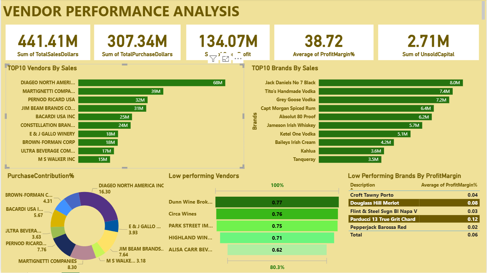

# Vendor Sales Analysis Project

This project analyzes vendor sales performance using **SQL**, **Python**, and **Power BI** to uncover trends, calculate KPIs, and visualize insights for better decision-making.

## 📊 Project Overview
- **Data Ingestion:** Imported CSV datasets into an SQL database for structured storage.
- **SQL Processing:** Utilized `JOIN`, `GROUP BY`, `CASE`, and 'CTE' to calculate:
  - Summary of performance 
  - Top-selling products
  - Vendor rankings
- **Python Processing:** Applied Pandas for:
  - Data cleaning: `dropna()`, `fillna()`
  - Feature engineering: `apply()`, `groupby()` for aggregations
- **Visualization:** Designed an interactive **Power BI** dashboard to highlight:
  - Vendor sales trends
  - Category performance(Top Vendors and Top Brands)
  - Unsold Inventory

## 📊 DashBoard Preview

